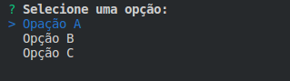
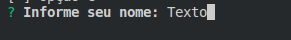
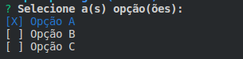

# PROMPTER
Bitcode similiar ao Inquirer (que é escrito em Nodejs).

## Plugins
* list
* question
* multi-select

## Utilização

Instale a dependência.

```bash
thrust install prompter
```

```js
var prompter = require('thrust-bitcodes/prompter');

var ret = prompter.prompt([{
    type: 'list',
    name: 'sexo',
    message: 'Selecione o sexo'
    options: {
        list: ['Masculino', 'Feminino']
    }
}]);

console.log(ret); // {sexo: 0 ou 1}
```

## Componentes

### list

Lista de seleção única



### question

Entrada de texto



### multi-select

Lista de seleção múltipla.



## TODO

Este bitcode ainda está em desenvolvimento.

Lista de tarefas:
- [ ] Suporte para Win e Mac.
- [ ] Componente de Sim/Não (e outras opções de letras).
- [ ] Melhorar as cores apresentadas.
- [ ] Validação das entradas em cada componente.